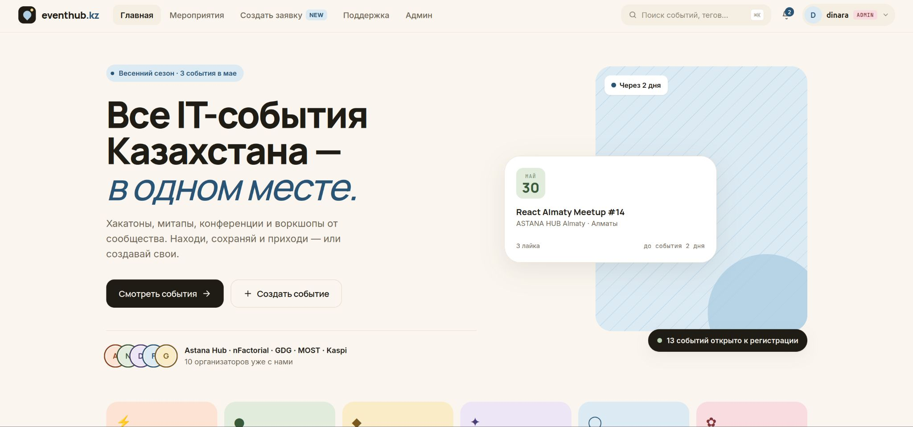
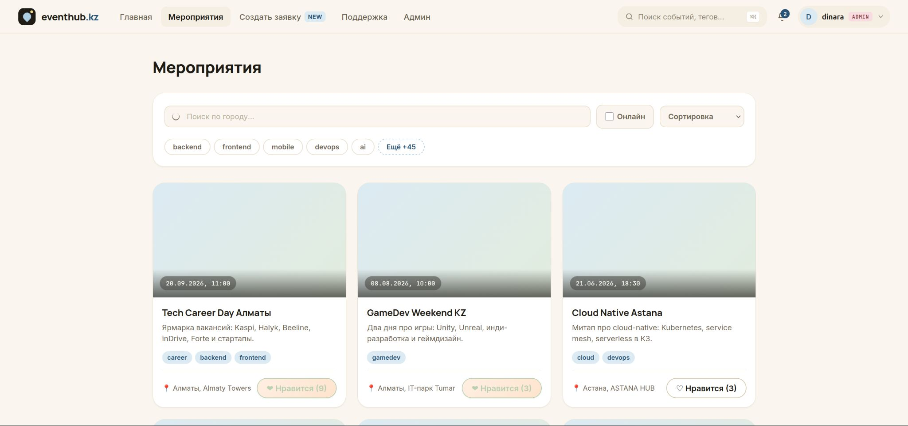
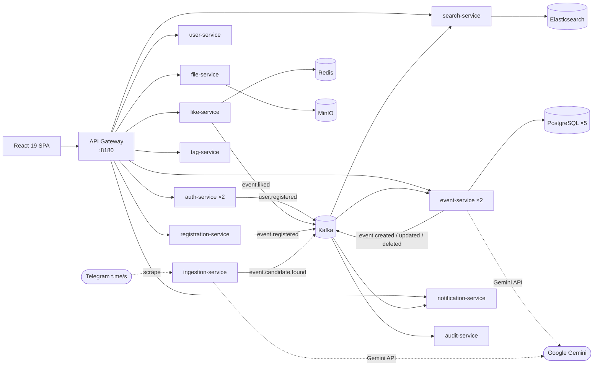

# EventHub.kz

**All IT events of Kazakhstan — in one place.**

A full-stack event platform where communities publish meetups, hackathons and conferences, and attendees discover, register and check in — built as a 13-service polyglot microservice system (Spring Cloud + a Python ingestion service) with an event-driven Kafka backbone, an AI parser that seeds the catalog from public Telegram channels, AI-assisted moderation and full observability.




## Why

IT events in Kazakhstan are scattered across Telegram channels, Instagram pages and university mailing lists — there is no single catalog, no tag search, no way to subscribe. Global platforms (Eventbrite, Meetup) have no Kazakh language support, no local communities and paid plans for organizers. EventHub.kz closes that gap: free for organizers, RU/KK interface, tag-based discovery and native RSVP.

## Features

- **Event catalog** — full-text search (Elasticsearch, Russian morphology), filtering by tags / city / format (online/offline), sorting by date and popularity
- **Organizer flow** — structured event submission, admin moderation with approve/reject + comments, organizer dashboard with attendee stats and Excel export
- **Native RSVP** — one-click registration, per-event QR tickets, check-in codes for organizers, attendance tracking, capacity-aware counters
- **Calendar export** — download any event as `.ics` or add it to Google Calendar in one click
- **AI, integrated where it saves real work** (Google Gemini):
  - auto-suggest event tags from the description, strictly validated against the tag dictionary
  - support chat assistant with topic filtering and prompt-injection protection; one-click escalation of the full conversation to a human admin
- **Notifications** — in-app + HTML email (welcome, moderation verdict, registration confirmation with embedded QR ticket, event reminders), all delivered asynchronously via Kafka with idempotent consumers
- **Profiles** — avatars (MinIO), social contacts, interest tags, liked & registered event lists
- **i18n** — Russian / Kazakh interface switcher (react-i18next)
- **Auth** — JWT (validated at the gateway), email verification with one-time codes, roles (user / admin), BCrypt password hashing



## Architecture



Every service registers in **Eureka** and is reachable only through the **Spring Cloud Gateway** (JWT check, circuit breakers, rate-aware routing; `auth-service` and `event-service` run as 2 load-balanced replicas). Services own their data (database-per-service, 5 PostgreSQL instances) and communicate asynchronously through Kafka.

| Service | Port | Responsibility |
|---|---|---|
| eureka-server | 8761 | Service discovery |
| api-gateway | 8180 | Single entry point: routing, JWT validation, circuit breakers |
| auth-service | ×2 replicas | Registration, login, email verification, JWT issuing |
| user-service | 8082 | Profiles, contacts, interest tags |
| event-service | ×2 replicas | Events, submissions, moderation, support, AI functions |
| like-service | 8084 | Likes with Redis-cached per-event counters |
| registration-service | 8089 | RSVP, QR tickets, check-in, attendance |
| search-service | 8085 | Full-text search (Elasticsearch), bulk indexing consumer |
| notification-service | 8086 | In-app + email notifications, idempotent Kafka consumers |
| tag-service | 8087 | Tag dictionary |
| file-service | 8088 | Uploads to MinIO via presigned URLs |
| audit-service | 8091 | Immutable audit trail of all domain events (admin journal) |
| ingestion-service | 8092 | AI parser (Python/FastAPI): reads public Telegram channels via the `t.me/s` web mirror, extracts structured events with Gemini, dedupes and feeds candidates into the moderation queue |

### Kafka topics

| Topic | Producer | Consumers |
|---|---|---|
| `user.registered` | auth-service | notification-service |
| `event.created` / `event.updated` / `event.deleted` | event-service | search-service, notification-service, registration-service |
| `event.liked` | like-service | notification-service, event-service |
| `event.registered` | registration-service | notification-service |
| `event-request.created` | event-service | audit-service |
| `event-request.reviewed` | event-service | notification-service |
| `user.deleted` | user-service | event-service, like-service, registration-service, notification-service, audit-service |
| `event.candidate.found` | ingestion-service | event-service |

Consumers are **idempotent**: notifications are deduplicated by a deterministic key (user, type, related entity), so Kafka redeliveries and consumer restarts never produce duplicates. The search consumer batches messages and writes to Elasticsearch via the bulk API.

## Tech stack

| Layer | Technologies |
|---|---|
| Backend | Java 21, Spring Boot 3.4, Spring Cloud (Gateway, Eureka, OpenFeign, Resilience4j) |
| Ingestion | Python 3.12, FastAPI, httpx + BeautifulSoup (Telegram `t.me/s` scraping), APScheduler, kafka-python |
| Frontend | React 19, Vite, react-i18next |
| Data | PostgreSQL ×5, Elasticsearch 8 (Russian analyzer), Redis, MinIO (S3) |
| Messaging | Apache Kafka |
| AI | Google Gemini 2.5 Flash Lite |
| Observability | Prometheus, Grafana (4 dashboards), Zipkin (distributed tracing), Micrometer |
| Testing | JUnit 5, Mockito, Testcontainers (real PostgreSQL/Kafka/ES in tests), k6 |
| Delivery | Docker Compose (25 containers), GitHub Actions CI |

## Performance

The platform was hardened against a "registration crush" scenario (a popular event opens and thousands of users log in at once) and verified with a [k6 spike test](loadtest/spike.js) on a single 15 GB laptop:

- **Steady browse load:** 500 req/s against catalog/search endpoints — median latency **~96 ms**
- **Login spike on top:** ramp to 250 logins/s (BCrypt-bound worst case) — **4,477 successful logins, 0 login failures**, overall error rate 0.86% across 33k requests

What made it hold: Redis caching of like/registration counters with write-through eviction, Kafka batch consumption + Elasticsearch bulk indexing, tuned Hikari pools, 2× replicas of auth/event services behind the gateway, and right-sized JVM heaps. Full results in [`loadtest/`](loadtest/).

## Getting started

Prerequisites: Docker + Compose plugin, JDK 21, Maven, Node 20+.

```bash
git clone https://github.com/NUKI1223/EventHubKzNew.git
cd EventHubKzNew

cp .env.example .env   # fill in secrets (JWT, SMTP, Gemini API key)

./start.sh --build --seed        # build jars & images, start stack, seed demo data
```

> **Upgrading an existing stack?** The audit service needs its database once:
> `docker exec postgres-notifications psql -U postgres -c "CREATE DATABASE audit_db;"`
> (fresh volumes create it automatically via `db-init/`).

The script waits for the gateway, seeds demo events/users (idempotent) and starts the Vite dev server:

| URL | What |
|---|---|
| http://localhost:5173 | Frontend |
| http://localhost:8180 | API Gateway |
| http://localhost:8761 | Eureka dashboard |
| http://localhost:9101 | MinIO console |

Demo accounts (password `password123`): `aidar.kasenov@example.kz` (user), `dinara.zhumabaeva@example.kz` (admin).

Useful flags:

```bash
./start.sh --with-monitoring   # + Prometheus/Grafana/Zipkin/Kafka UI (~2 GB extra RAM)
./start.sh --no-front          # backend only
./start.sh stop                # stop everything
./start.sh logs event-service  # tail a service log
```

By default the stack runs in *lite* mode (~6 GB RAM, no monitoring containers) so it fits on a laptop.

## Production deployment

Local dev publishes debug ports to `127.0.0.1` via `docker-compose.override.yml`
(auto-loaded). Production publishes **only** Caddy's 80/443 — every service and
database stays on the internal network.

1. Point your domain's A record at the server; set `APP_DOMAIN` in `.env.prod`.
2. Copy `.env.prod.example` → `.env.prod`, fill STRONG values, `chmod 600 .env.prod`.
   **Rotate** the three secrets that were briefly in git history: `JWT_SECRET`
   (`openssl rand -base64 32`), the Gmail app-password, and the Gemini API key.
3. Build the frontend: `cd frontend && VITE_API_URL=https://eventhub.kz npx vite build`
   (use your `APP_DOMAIN`). `VITE_API_URL` must be the full origin (scheme+host),
   not a path — call sites already prepend `/api` and `/auth`, so a value like
   `/api` produces broken double-prefixed URLs (`/api/api/events`).
4. Deploy:
   ```bash
   docker compose --env-file .env.prod \
     -f docker-compose.yml -f docker-compose.caddy.yml up -d --build
   ```
   Caddy obtains a Let's Encrypt certificate automatically on first request.
   (`GRAFANA_PASSWORD` in `.env.prod` only applies if you also opt into the
   `observability` profile — Grafana isn't started by this base command.)
5. Verify with `scripts/prod-smoke.sh <domain>` (see below).

Set 1 hardens network isolation, TLS, and infra credentials. Elasticsearch
`xpack.security` stays disabled by design — network isolation removes its
exposure; revisit if ES ever leaves the internal network. Rate limiting, inbound
`X-User-*` stripping, refresh-token revocation, and Flyway are tracked as set 2/3.

## Testing

```bash
mvn verify                         # unit + integration tests (Testcontainers)
k6 run load-test/events-load.js    # read-path load test
k6 run loadtest/spike.js           # login-spike scenario
```

CI (GitHub Actions) builds every service and the frontend, and runs the full test suite on each push/PR to `master`.

## Roadmap

- [ ] Public deployment (VPS + HTTPS) at eventhub.kz
- [ ] AI ingestion of events from Telegram community channels (LLM-extracted, human-moderated)
- [ ] Recommendations via embeddings of user tags × event descriptions
- [ ] Flyway migrations, refresh tokens
- [ ] Kubernetes (k3s + Helm) deployment
- [ ] Telegram Mini App client

---

*Built by [Vlad Karpov](https://github.com/NUKI1223) as a graduation project at Astana IT University College, then grown well past it.*
